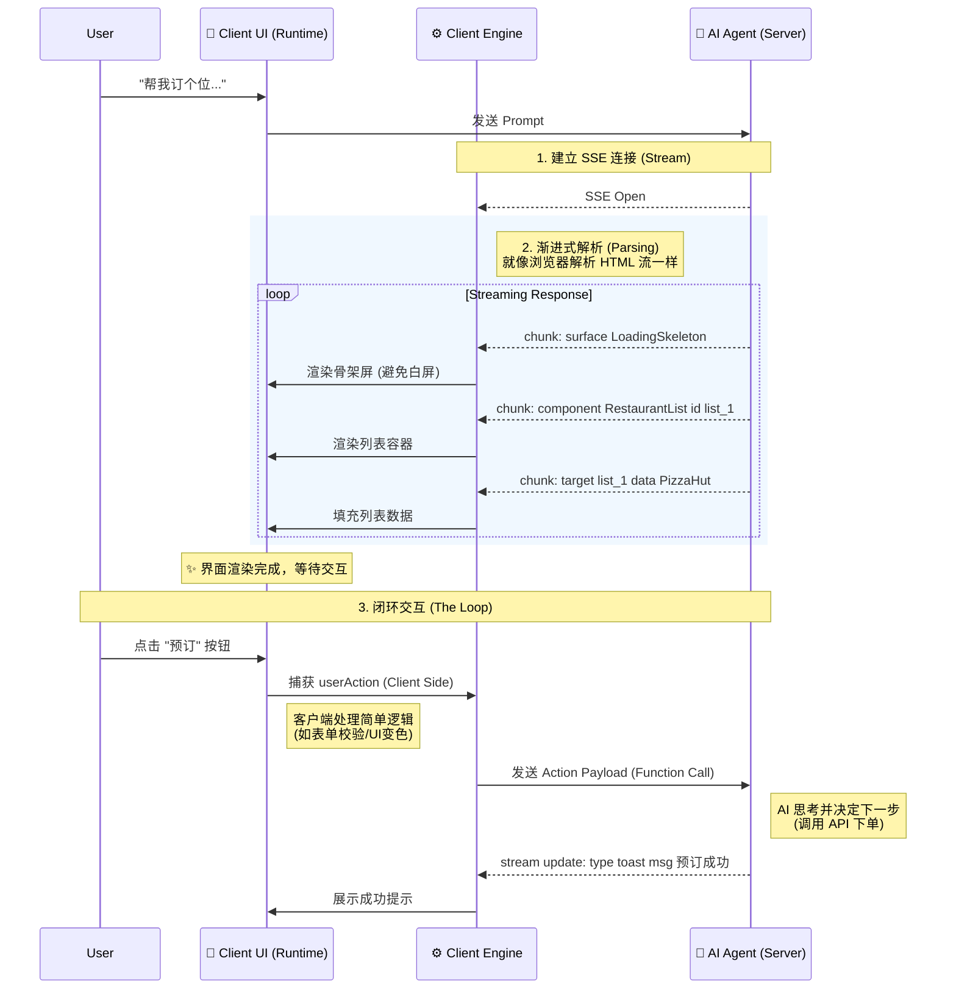
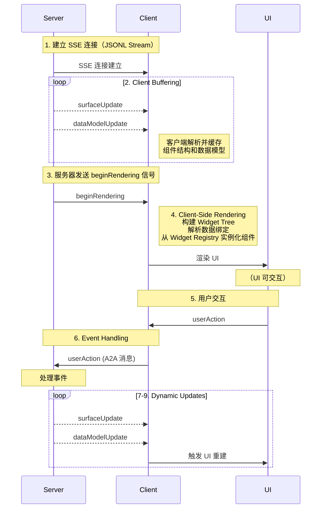

为什么需要 A2UI ？

问题：传统的AI应用中，AI只能通过对话时的方式进行和用户进行交互，交互效率低下，如
```markdown
User: "帮我订个位，两个人，明晚 7 点。"
Agent: "好的，请问您想去哪家餐厅？"
User: "就楼下那家意大利面。"
Agent: "好的，正在为您查询... 抱歉，那家店明晚 7 点没位子了，7 点半可以吗？"
User: "行吧。"
Agent: "好的，请确认您的联系方式..."
...
```
而在GUI应用程序中，你只需要点击几下按钮就可以：选择日期，滚一下时间槽,就可以了

所以这种完全依赖文本的交互（Text-based Interaction）虽然通用，但在处理复杂参数输入或展示结构化信息时，效率极其低下。

**ask: 为什么我们不能直接生成界面？**

既然文本低效，为什么不让 LLM 直接生成界面？

在 A2UI 出现之前，我们通常面临两个极端：

直接生成代码（HTML/JS）： 让 AI 输出前端代码并在客户端 eval 或 dangerouslySetInnerHTML。这无异于给 XSS 攻击敞开大门，且样式难以统一。

硬编码 UI（Function Calling）： 开发者预先写死几个 UI 组件，通过 AI 触发特定函数来调用。这种方式安全，但极其死板，无法应对 AI 动态生成的复杂意图。

---


---


---



（未完成）

